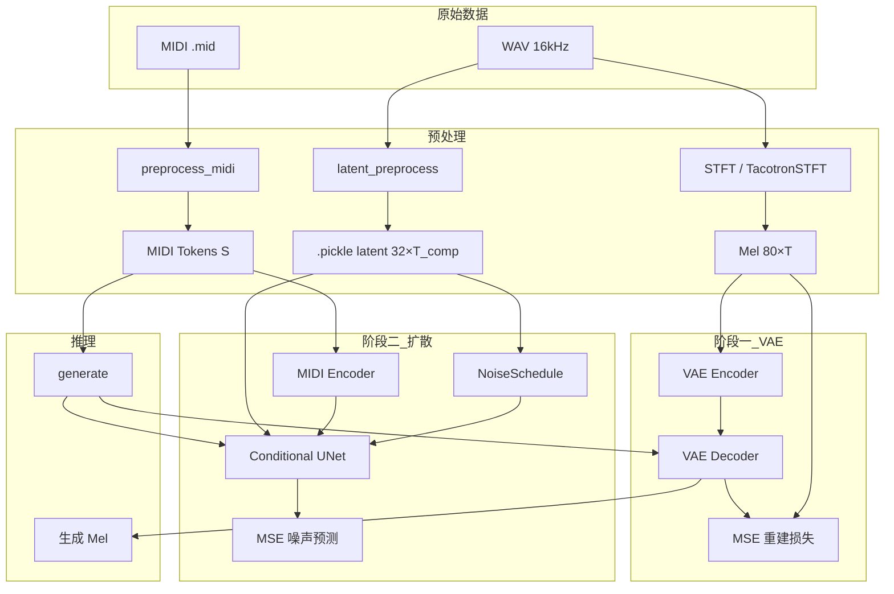
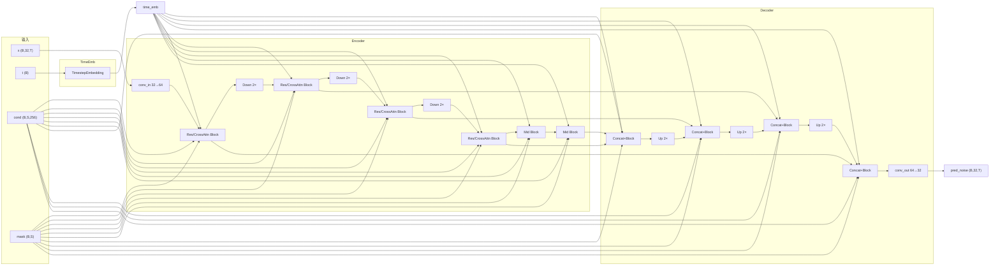
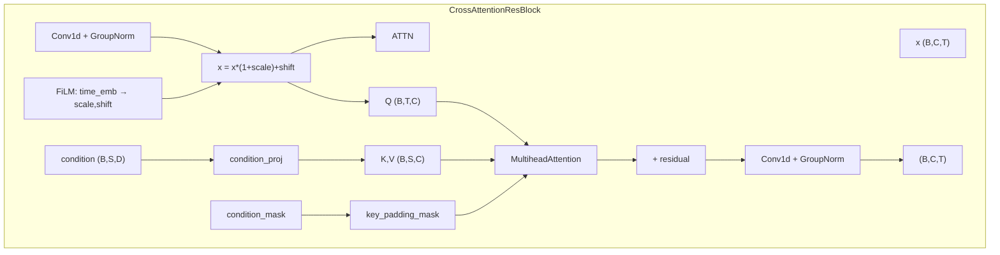
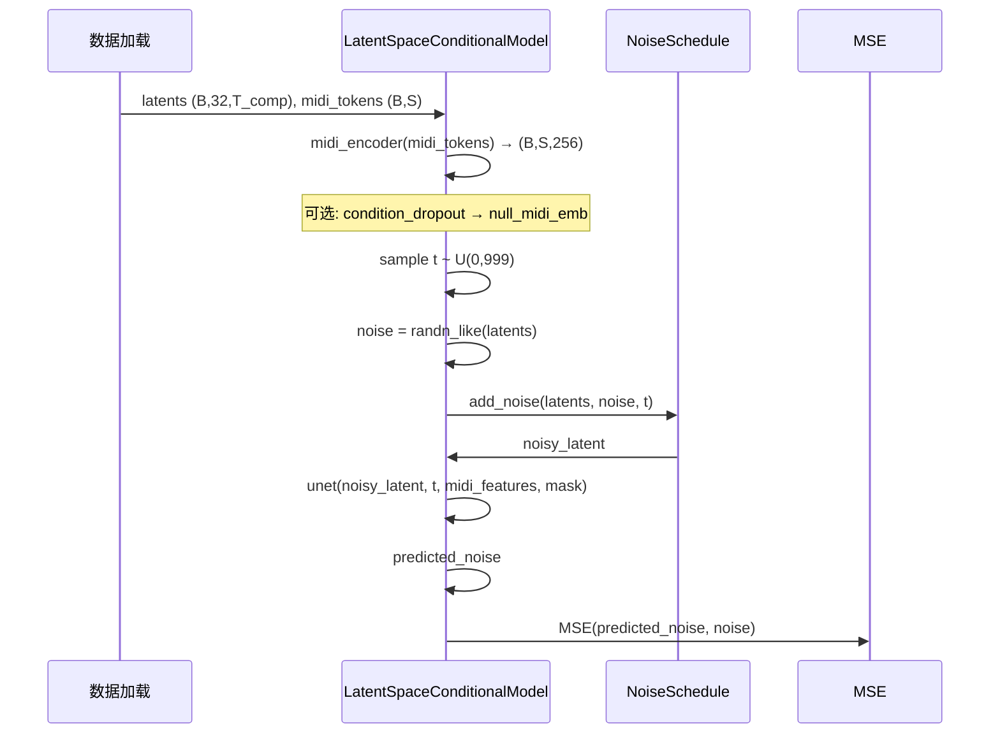

# AudiowithMDI-TangoScheme3 项目详细结构分析

## 一、项目概述

本项目实现 **方案三（Scheme3）**：基于 **潜在空间扩散模型** 的 MIDI 条件音频生成，参考 Tango 项目。核心思路：

- **两阶段训练**：先预训练 VAE（Mel→潜在空间），再在潜在空间上训练以 MIDI 为条件的扩散 UNet。
- **条件生成**：以 MIDI token 序列为条件，在潜在空间中做 DDPM 去噪，再经 VAE 解码得到 Mel，可再接 vocoder 得到波形。

---

## 二、数据输入与输出

### 2.1 原始数据输入

| 类型 | 路径/来源 | 格式 | 说明 |
|------|-----------|------|------|
| **音频** | `SMD-piano_v2/` 等 WAV 目录 | 16kHz 单声道 WAV | 与 MIDI 同名的配对音频 |
| **MIDI** | 同目录下的 `.mid` / `.midi` | 标准 MIDI 文件 | 与 WAV 通过 basename 配对 |

### 2.2 预处理后的数据形态

**MIDI → Token 序列（preprocess_midi / encode_midi）**

- 词表：`event_dim = 388`（note_on 128 + note_off 128 + time_shift 100 + velocity 32）
- 特殊 token：`pad_token=388`, `token_sos=389`, `token_eos=390` → `vocab_size=391`
- 输出：一维整数序列 `[t1, t2, ..., tS]`，长度 S ≤ `max_seq`（如 2048）
- 训练时按 batch 右填充到 `max_midi_len`，用 `config.pad_token` 填充

**音频 → Mel 频谱（阶段一 VAE 训练）**

- STFT：`TacotronSTFT`，filter_length=1024, hop_length=160, win_length=1024
- Mel：80 维，mel_fmin=0, mel_fmax=8000, 16kHz
- 形状：`(B, n_mel_channels, T)` = `(B, 80, T)`，T 为帧数

**音频 → 潜在特征（阶段二扩散训练）**

- 由 `latent_preprocess.py` 离线完成：WAV → STFT → Mel → **VAE Encoder** → 潜在向量
- 保存为 `.pickle`，形状 `(latent_dim, T_compressed)` = `(32, T//4)`
- 训练时按 batch 在时间维右侧补零到 `max_latent_len`

### 2.3 模型输出

- **训练阶段二**：预测噪声 `predicted_noise`，与真实噪声 `noise` 做 MSE。
- **推理（generate）**：  
  - 输出 1：潜在向量 `latent`，形状 `(B, latent_dim, T_compressed)`  
  - 输出 2：Mel 频谱 `generated_mel`，形状 `(B, n_mel_channels, T)`，由 VAE Decoder(latent) 得到。

---

## 三、网络各层结构

### 3.1 整体模型：LatentSpaceConditionalModel

```
LatentSpaceConditionalModel
├── vae_encoder    : LatentAudioEncoder      (阶段二冻结)
├── vae_decoder    : LatentAudioDecoder      (阶段二冻结)
├── midi_encoder   : Encoder (Music Transformer)
├── null_midi_emb  : 可学习向量 (1,1,embedding_dim) 用于 CFG
├── unet           : ConditionalUNet
└── noise_schedule : NoiseSchedule
```

### 3.2 VAE 编码器（LatentAudioEncoder）

- **输入**：Mel `(B, 80, T)`
- **结构**：
  - `conv_in`: Conv1d(80 → 128, k=7, pad=3)
  - `residual_layers`: 3 个 ResidualBlock(dilation=1,2,4)
  - `conv_compress`: Conv1d(128→128, k=4, stride=4) 时间压缩 4 倍
  - `conv_out`: Conv1d(128 → 32)
- **输出**：`(B, latent_dim, T_compressed)` = `(B, 32, T//4)`

### 3.3 VAE 解码器（LatentAudioDecoder）

- **输入**：潜在向量 `(B, 32, T_compressed)`
- **结构**：
  - `conv_in`: Conv1d(32 → 128, k=1)
  - `conv_upsample`: ConvTranspose1d(128→128, k=4, stride=4)
  - `residual_layers`: 3 个 ResidualBlock
  - `conv_out`: Conv1d(128 → 80, k=7, pad=3)
- **输出**：Mel `(B, 80, T)`

### 3.4 MIDI 编码器（Encoder, Music Transformer 风格）

- **输入**：token ids `(B, S)`，可选 mask
- **结构**：
  - Embedding(vocab_size, embedding_dim=256)
  - DynamicPositionEmbedding
  - 6 层 EncoderLayer：RelativeGlobalAttention + FFN
- **输出**：`(B, S, embedding_dim)` = `(B, S, 256)`，作为 UNet 的 condition

### 3.5 噪声调度（NoiseSchedule）

- 默认 1000 步，cosine 调度
- `add_noise(x, noise, t)`：前向扩散  
  `x_t = sqrt(ᾱ_t)*x_0 + sqrt(1-ᾱ_t)*noise`
- `sample(pred_noise, x_t, t)`：单步去噪采样

### 3.6 条件 UNet（ConditionalUNet）

- **输入**：  
  - `x`: 带噪潜在 `(B, 32, T_compressed)`  
  - `timestep`: (B,)  
  - `condition`: MIDI 特征 `(B, S, 256)`  
  - `condition_mask`: (B, S) 有效 token 掩码

**时间嵌入**  
- `TimestepEmbedding(512)`：sinusoidal + MLP(512→2048→512)

**编码器 UNetEncoder**

- `conv_in`: Conv1d(32 → 64, k=3, pad=1)
- 多尺度下采样，`channel_multipliers = [1,2,4,8]`：
  - 每个尺度 2 个块（ResBlock 或 CrossAttentionResBlock）
  - 块间用 Conv1d stride=2 下采样
- 中间块：2 个 CrossAttentionResBlock
- 每个 ResBlock / CrossAttentionResBlock 内：
  - 时间步通过 FiLM(scale, shift) 注入
  - 条件：Cross-Attention 时用 MIDI 序列 (B,S,256) 做 key/value，query 为当前特征 (B,T,C)；带 `condition_mask` 忽略 padding
- **Skip**：每个 resblock 输出按浅→深存入 list，供 decoder 使用

**解码器 UNetDecoder**

- 每层先与对应 skip 在通道维 concat，再经过 ResBlock/CrossAttentionResBlock
- 上采样：ConvTranspose1d stride=2
- `conv_out`: Conv1d → 32 通道
- **输出**：预测噪声 `(B, 32, T_compressed)`

---

## 四、数据对齐与融合细节

### 4.1 MIDI 与潜在在“时间”上的关系

- **无显式帧级对齐**：不要求 MIDI 与音频逐帧对齐。
- **潜在时间**：`T_compressed = T_mel // 4`，与 Mel 帧数成固定比例。
- **对齐方式**：  
  - 训练/推理时，MIDI 序列长度 S 与潜在时间 T_compressed 可以不同。  
  - 通过 **Cross-Attention** 在 UNet 内部让“潜在序列”对“MIDI 序列”做注意力，由模型自己学习对应关系（弱对齐）。

### 4.2 Batch 内对齐与 Padding

- **MIDI**：同一 batch 内右填充到 `max_midi_len`，pad_token=388；`condition_mask` 中 padding 位置为 False，Cross-Attention 的 `key_padding_mask` 会忽略这些位置。
- **潜在**：同一 batch 内按 `max_latent_len` 在时间维右侧补零。
- **配对**：每个样本是 (midi_path, audio_latent_path) 一一对应，batch 内按样本对齐，不要求 S 与 T_compressed 相等。

### 4.3 条件注入方式（融合）

- **FiLM（ResBlock / CrossAttentionResBlock）**：时间嵌入与部分条件经线性层得到 (scale, shift)，做 `x = x*(1+scale)+shift`。
- **Cross-Attention**：  
  - Query：当前层潜在特征 (B, T, C)  
  - Key/Value：MIDI 特征经 `condition_proj` 得到 (B, S, C)  
  - 使用 `condition_mask` 生成 `key_padding_mask`，padding 不参与 attention。  
- **CFG（无分类器引导）**：  
  - 训练时以一定概率用 `null_midi_emb` 替换 MIDI 条件。  
  - 推理时 `noise_pred = pred_uncond + guidance_scale * (pred_cond - pred_uncond)`。

### 4.4 弱对齐相关模块（可选）

- `weak_alignment_methods.py` 提供对比学习、多尺度条件等，本方案主流程不强制使用；主对齐依赖 Cross-Attention + 联合训练。

---

## 五、训练方式

### 5.1 阶段一：VAE 预训练（train_scheme3_vae.py）

- **数据**：仅 WAV，经 STFT 得到 Mel `(B, 80, T)`，可选 `max_frames` 截断/填充。
- **模型**：只更新 `vae_encoder` + `vae_decoder`，冻结 `midi_encoder`、`unet`。
- **损失**：MSE(mel_reconstructed, mel_input)。
- **输出**：保存 VAE 权重（或完整 checkpoint），供阶段二和预处理使用。

### 5.2 潜在预处理（latent_preprocess.py）

- 使用阶段一训练好的 VAE（或当前项目中的 encoder），对所有 WAV 做 Mel → Encoder → 潜在。
- 结果存成 `.pickle`，形状 `(32, T_compressed)`，供阶段二直接读取。

### 5.3 阶段二：潜在空间扩散训练（train_scheme3.py）

- **数据**：配对 (MIDI 文件, 预计算 latent 的 .pickle)。
- **前向**：  
  - 用预计算 latent，不经过 VAE encoder。  
  - MIDI → midi_encoder → midi_features；可选 condition_dropout 做 CFG 训练。  
  - 采样 t，加噪：noisy_latent = schedule.add_noise(latent, noise, t)。  
  - UNet(noisy_latent, t, midi_features, condition_mask) → predicted_noise。  
- **损失**：MSE(predicted_noise, noise)。  
- **优化**：只更新 midi_encoder + unet + null_midi_emb，VAE 冻结。

### 5.4 推理（evaluate_scheme3.py / generate）

- 输入 MIDI → midi_encoder → midi_features。
- 从随机噪声 `(B, 32, T_compressed)` 出发，按噪声调度迭代去噪（如 50 步）。
- 可选 CFG：同一 latent、同一 t 分别用条件/无条件特征前向，再线性组合得到 noise_pred。
- 最后一步 latent 送入 VAE Decoder → Mel；评估脚本再与参考音频的 Mel 比 L1/L2/SC/log、能量相关、FD、KL 等。

---

## 六、结构图

### 6.0 架构总览示意图

项目根目录下已生成架构总览图，路径：`docs/scheme3_architecture_overview.png`，包含两阶段数据流、VAE、扩散 UNet 及推理流程的概览。

### 6.1 整体数据流与两阶段训练（Mermaid）



### 6.2 条件 UNet 内部结构（编码器-解码器 + 融合）



### 6.3 单块内条件融合（CrossAttentionResBlock）



### 6.4 训练阶段二单步前向



---

## 七、文件与脚本对应关系

| 文件 | 作用 |
|------|------|
| `train_scheme3_vae.py` | 阶段一：VAE 预训练（Mel 重建） |
| `latent_preprocess.py` | 将 WAV 转为潜在 .pickle |
| `train_scheme3.py` | 阶段二：潜在空间扩散训练（读 .pickle + MIDI） |
| `evaluate_scheme3.py` | 加载 checkpoint，MIDI→生成 Mel，与参考 Mel 算指标 |
| `audio/latent_encoder.py` | VAE 编码器/解码器、LatentAudioProcessor |
| `audio/latent_preprocess.py` | 批量 WAV→潜在并保存 |
| `audio/scheme3/latent_conditional_model.py` | LatentSpaceConditionalModel 总模型 |
| `audio/scheme3/unet.py` | ConditionalUNet、TimestepEmbedding、ResBlock、CrossAttentionResBlock |
| `audio/scheme3/noise_schedule.py` | 扩散噪声调度 |
| `midi/preprocess.py` | 调用 encode_midi |
| `midi/midi_processor/processor.py` | MIDI→event 序列、词表 388/391 |
| `midi/custom/layers.py` | Encoder、RelativeGlobalAttention 等 |
| `midi/custom/config.py` | event_dim, pad_token, vocab_size |

---

## 八、各层张量形状速查（便于对齐与调试）

| 阶段 | 变量 | 形状 | 说明 |
|------|------|------|------|
| 输入 | midi_tokens | (B, S) | S 为填充后长度 |
| 输入 | latents / mel | (B, 32, T_comp) / (B, 80, T) | 阶段二用 latent，阶段一用 mel |
| MIDI Encoder 输出 | midi_features | (B, S, 256) | condition_dim=256 |
| VAE Encoder 输出 | latent | (B, 32, T//4) | compression_factor=4 |
| UNet 输入/输出 | x, pred_noise | (B, 32, T_comp) | in_channels=32 |
| UNet 编码器通道 | 各层 | 64→64→128→256→512 | base=64, mult=[1,2,4,8] |
| Cross-Attention | query | (B, T_comp, C) | 来自当前层特征 |
| Cross-Attention | key, value | (B, S, C) | 来自 condition_proj(midi_features) |
| condition_mask | valid_mask | (B, S) bool | True=有效 token，False=padding |

以上为项目的数据输入输出、网络各层、对齐与融合细节以及两阶段训练方式的完整分析；所绘结构图可从本 Markdown 中的 Mermaid 代码渲染得到，总览图见 `docs/scheme3_architecture_overview.png`。
